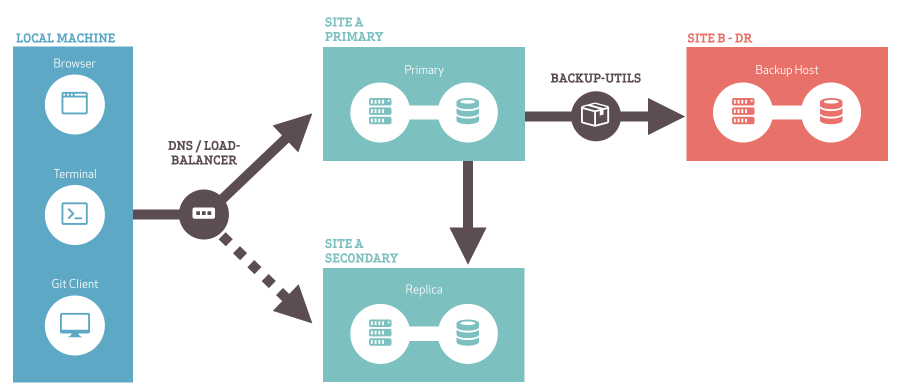
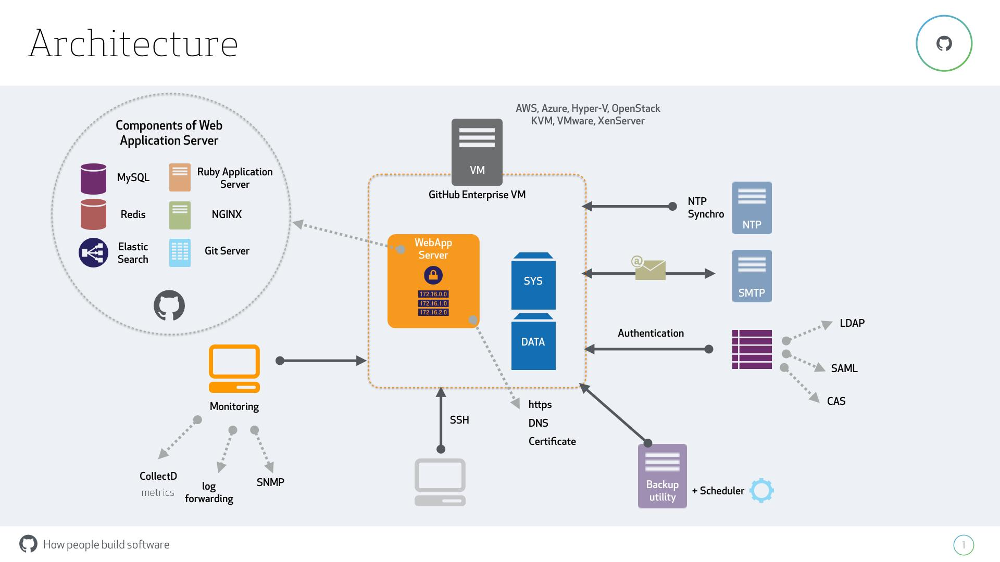

# GitHub Enterprise FAQ

Allgemein

* Wie unterstützen sie eine Migration von SVN?

    * Technisch, fachlich, Projekt

Zusammengefasst ist es möglich

1. auf in GitHub gehostete Repositories weiterhin mit [SVN-Clients](https://help.github.com/articles/support-for-subversion-clients/) zuzugreifen, welches einen sanften Umstieg von Subversion-Entwicklern und CI-Tool-Chains ermöglicht. Für einen kombinierten Betrieb von Subversion und Git, empfehlen wir diesen [Blog](https://github.com/blog/1178-collaborating-on-github-with-subversion).

2. SVN Repositories mittels [kostenfreien Werkzeugen](https://services.github.com/kit/downloads/subversion-migration.html) selbst zu migrieren, GitHub Enterprise bringt [Spezialwerkzeuge](https://help.github.com/enterprise/2.9/admin/guides/migrations/importing-data-from-third-party-version-control-systems/) mit

3. Unsere [Professional-Services](https://services.github.com/) zur Migration zu nutzen

Git und Subversion haben unterschiedliche [Design-Philosophien](https://help.github.com/articles/what-are-the-differences-between-subversion-and-git/), welches dazu führt, dass während der Migration eines Subversion-Repositories mitunter

* Mehrere Git-Repositories entstehen

* Große Dateien [automatisch](https://github.com/rtyley/bfg-repo-cleaner/releases) nach [Git LFS](https://github.com/blog/1986-announcing-git-large-file-storage-lfs) ausgelagert werden

* Subversion-Externals in älteren Revisionen [angepasst](http://stackoverflow.com/questions/204616/how-to-migrate-all-urls-in-svnexternals-properties-across-a-repository) werden

Für mehr Details stehen Ihnen unser Solution Engineering Team und unser Support gerne zur Verfügung.

* Können Instanzen "isoliert" betrieben und genutzt werden? Wie können diese trotzdem interagieren? (Projektspezifische Instanzen)

GitHub empfiehlt den Betrieb möglichst aller Software-Projekte auf einer Instanz um die Idee der Projekt-Wiederverwendung und den[ Inner Source](https://paypal.github.io/InnerSourceCommons/)-Gedanken zu fördern. Die in GitHub [integrierte Rechteverwaltung](https://vimeo.com/179075921/a774e76f4f) sorgt dafür, dass gesamte Organisationen, einzelne Repositories oder individuelle Branches sauber voneinander getrennt werden können. Technisch ist es jedoch ohne weiteres möglich, mehrere Instanzen von GitHub Enterprise zu betreiben. Da Git von Grund auf als verteiltes Versionskontrollsystem konzipiert wurde, können Repositories mühelos zwischen verschiedenen Instanzen[ migriert](https://git-scm.com/book/en/v2/Git-Basics-Working-with-Remotes) werden. Besteht der Wunsch, zusätzliche Meta-Informationen wie Pull-Requests, Issues oder Wikis auf andere Instanzen zu migrieren, stellt GitHub dafür [Migrationswerkzeuge](https://github.com/blog/2171-migrate-your-repositories-using-ghe-migrator) zur Verfügung. Weiterhin ist es möglich, zwischen GitHub.com und GitHub Enterprise eine automatische Synchronisation [aufzusetzen](https://github.com/gjtorikian/repository-sync).

* Ich welcher Granularität gibt es bei Github Enterprise neue Versionen? (Einzelfeatures oder Gesamtsystem)

Typischerweise steht alle 3 Monate ein neues Major-Release von GitHub Enterprise zur Verfügung, welche alle neuen Funktionalitäten, die in der Zwischenzeit auf GitHub.com released wurden enthält.
Beispielsweise wird GitHub Enterprise 2.8, grundlegende neue Features im Bereich [Code Reviews](https://www.youtube.com/watch?v=HW0RPaJqm4g), [Projekt-Management](https://www.youtube.com/watch?v=C6MGKHkNtxU), [Profile-Timeline](https://www.youtube.com/watch?v=6ECfLU5vC7I) und [vielem mehr](https://github.com/blog/2256-a-whole-new-github-universe-announcing-new-tools-forums-and-features) enthalten. 

Bugfixes und nicht sicherheitskritische Updates werden in Form von einem Minor-Release pro zwei bis vier Wochen zur Verfügung gestellt. Sicherheitskritische Hotfixes werden sofort zur Verfügung gestellt. Die Verfügbarkeit von Updates kann bei bestehender Internetverbindung [automatisch](https://help.github.com/enterprise/2.6/admin/guides/installation/enabling-automatic-update-checks/), oder über unsere

Web-Oberfläche geprüft werden. Ein Upgrade bezieht sich dabei immer auf das Gesamtsystem und ist innerhalb weniger Minuten abgeschlossen.
Anbei ein [Überblick über die Sicherheit von GitHub Enterprise](https://enterprise.github.com/security), sowie unser [Bug Bounty Programm](https://bounty.github.com/index.html#home).

Rollen & Rechte

* Wie funktioniert ihr Rollen- und Rechtekonzept?

GitHub Enterprise bietet Lese-, Schreib- und Administrations-Rechte auf [Branch-](https://help.github.com/articles/about-branch-restrictions/), [Repository-](https://help.github.com/articles/managing-team-access-to-an-organization-repository/) und[ Organisationsebene](https://help.github.com/enterprise/2.7/user/articles/repository-permission-levels-for-an-organization/). Zugriff wird über Teams und Collaborators innerhalb Organisationen (vergleichbar mit Rollen) sowie [Default-Rechten](https://help.github.com/enterprise/2.7/user/articles/about-improved-organization-permissions/) pro Organisation und [Repository-Sichtbarkeit](https://help.github.com/enterprise/admin/guides/installation/enabling-private-mode/) auf Instanzebene gesteuert. Team-Mitgliedschaften können automatisch über LDAP-Gruppen [synchronisiert](https://help.github.com/enterprise/2.7/admin/guides/user-management/creating-teams/#creating-teams-with-ldap-sync-enabled) werden.

Einen Überblick über die Konzepte finden Sie in diesem [Video](https://vimeo.com/179075921/a774e76f4f).

* Welche Basissystem der Unternehmen können angebunden? (LDAP, Crowd, SAML)

GitHub Enterprise unterstützt [SAML](https://help.github.com/enterprise/admin/guides/user-management/using-saml/), [CAS](https://help.github.com/enterprise/2.17/admin/guides/user-management/using-cas/)und [LDAP](https://help.github.com/enterprise/2.17/admin/guides/user-management/using-ldap/) als Identitätsprovider.  Für eine Schritt- für-Schritt-Anleitung für die Synchronisation zwischen LDAP und GitHub Enterprise, folgen Sie diesem [Video](https://www.youtube.com/watch?v=Ecjjbe_4md4).

* Level der Rechte gibt es bei ihnen in Bezug auf administrativen Aufgaben (Repo anlegen, User berechtigen) und fachlichen Tätigkeiten?

Einen Überblick über die Bedeutung unserer Zugriffsrechte auf Organisationsebene finden Sie [hier](https://help.github.com/articles/repository-permission-levels-for-an-organization/). Weiterhin existiert eine [Site-Admin-Weboberfläche](https://help.github.com/enterprise/2.17/admin/articles/site-admin-dashboard/) für Einstellungen, die die gesamte Instanz betreffen ([maximale Dateigrößen](https://help.github.com/enterprise/2.7/admin/articles/setting-git-push-limits/), [globale Pre-receive-Hooks](https://help.github.com/enterprise/2.17/admin/guides/developer-workflow/managing-pre-receive-hooks-on-the-github-enterprise-appliance/), das Recht, [neue Organisationen zu erstellen](https://help.github.com/enterprise/2.17/admin/guides/user-management/preventing-users-from-creating-organizations/), etc).

Für fachliche Tätigkeiten, insbesondere für die projektspezifische Entscheidung, wann ein Feature /Pull Request qualitativ gut genug ist, in die Produktion übernommen zu werden, dienen GitHub’s Protected Branches mit [Required Status Checks](https://github.com/blog/2051-protected-branches-and-required-status-checks). Einen sehr guten Überblick zu fachspezifischen Quality-Gates liefert dieses [Video](https://vimeo.com/183360439/e1cd516159).

Betriebsmodelle

* Wie arbeiten sie mit ihrem Support mit Unternehmens-Supportmodellen zusammen? (ITIL?)

GitHub bietet ein [ticket-basiertes](https://enterprise.github.com/support) Support-Modell (Zendesk) an, welches Sie bereits während der Trial-Phase kostenfrei testen können. Es gibt keine Limitierung der Ticket-Anzahl und Support ist bereits in den Lizenzkosten enthalten. Alle unsere Support-Ingenieure kennen unser Produkt in- und auswendig und sind direkt bei uns angestellt. Tickets werden zumeist von derselben Person abgeschlossen, die die initiale Bearbeitung begonnen hat. Support-Ingenieure arbeiten über die gesamte Welt verteilt, davon auch mehrere in Deutschland, welche auch auf Tickets in deutscher Sprache antworten können. Bei Bedarf und gegen Aufpreis ist es möglich, einen oder mehrere designierte Support-Ingenieure zu bekommen. 

* Welche Anforderungen haben sie an Infrastrukturbetrieb?

Da GitHub als [Virtual Appliance](https://enterprise.github.com/faq#faq-4) geliefert wird und sämtliche Komponenten vorkonfiguriert mit sich bringt, sowie keine externen Abhängigkeiten zu Datenbanken oder anderen Diensten hat, schätzen wir den Administrationsaufwand auf 0,15 FTE pro Monat pro 2000 Nutzern ein. Updates können innerhalb weniger Minuten eingespielt werden, [Disaster Recovery](https://help.github.com/enterprise/admin/guides/installation/backups-and-disaster-recovery) und [High Availability](https://help.github.com/enterprise/admin/guides/installation/high-availability-configuration) sind ebenfalls je in unter einer Stunde konfiguriert. Weiterhin steht Ihnen jederzeit unser technischer Support, welcher aus hochspezialisierten Ingenieuren in Ihrer Zeitzone besteht, zur Verfügung.

Fachliche Aspekte

* Wie funktionieren Pre- und Post-Commit Reviews?

Im Gegensatz zu Subversion wurde Git mit der Hauptanforderung designed, Branching und Merging so einfach wie möglich zu machen sowie eine verteilte Arbeitsweise zu ermöglichen. Da Git-Commits bereits im lokalen Git-Repository des Entwicklers auf seinem Rechner entstehen, gehen alle [etablierten Git-Review-Prozesse](https://blogs.technet.microsoft.com/devops/2016/06/21/a-git-workflow-for-continuous-delivery/) rein technisch gesehen von einem Post-Commit-Review aus. Der Code-Review geschieht jedoch bevor der entsprechende Commit in einen stabilen Branch auf dem Server einfließt / gemerged wird. Der dafür vorgesehene Prozess, welchen GitHub etabliert hat, wird [GitHub Flow](https://guides.github.com/introduction/flow/) genannt. GitHub Flow ermöglicht sowohl Code-Reviews als auch High-Level Diskussion mit verschiedenen Projekt-Teams. Zusätzlich werden die Test-Resultate von CI-Systemen und anderen integrierten Werkzeugen [angezeigt](https://vimeo.com/183360439/e1cd516159) und können die Mergebarkeit der vorgeschlagenen Änderungen [beeinflussen](https://github.com/blog/2051-protected-branches-and-required-status-checks).

Eine ausführliche Überblick über die verschiedenen Review-Workflows und Clients, die mit GitHub möglich sind, finden Sie [in diesem Video](https://www.youtube.com/watch?v=EwWZbyjDs9c).

Gerne beantworten wir Ihre spezifischen Review- und Workflow-Fragen auch mit einer Demo vor Ort.

* Wie stellt sich die Kopplung von Reviews und Jira-Ticket dar?

Zwischen GitHub und Atlassian besteht in mehreren Bereichen eine Partnerschaft. So wurde [Git LFS](https://git-lfs.github.com/) gemeinsam von beiden Unternehmen designed, implementiert und weiterhin vorangetrieben. Weiterhin besteht eine [Jira-Integration](https://help.github.com/en/enterprise/2.17/admin/developer-workflow/managing-projects-using-jira) zu GitHub. Diese ermöglicht es

* Von Jira aus alle mit Jira-Issues assoziierten GitHub-Branches und Reviews (Pull-Requests) sowie deren Status, Kommentare und Diskussionsteilnehmer zu sehen.

* Von GitHub aus, Commits und Reviews (Pull-Requests) mit Jira-Tickets zu verknüpfen sowie den Status, Kommentare und Zeiterfassung von Jira-Tickets zu verändern

* Zusätzlich gibt es ein kostenfreies Chrome-Plugin [Jirafy](https://chrome.google.com/webstore/detail/jirafy/npldkpkhkmpnfhpmeoahhakbgcldplbj?hl=en) welches es ermöglicht, sämtlichen Jira-Referenzen in GitHub-Reviews, Commits, Dokumentation, Releases und Wikis zu folgen

Alle drei Punkte zusammen führen zu einer bidirektionalen Integration der beiden Systeme ineinander. Für einen Überblick über die Funktionalitäten und die Konfiguration der Jira-Integration, steht Ihnen [dieses Video](https://vimeo.com/100550865) zur Verfügung. 

* Wie kann aus externen Tools auf Reviewergebnisse zugegriffen werden? (REST)

Sämtliche Daten innerhalb der GitHub-Plattform stehen Ihnen über unsere [REST-](https://developer.github.com/v3/enterprise/) und [GraphQL-API](https://developer.github.com/early-access/graphql/) zur Verfügung. Alle Informationen über Code-Reviews (Pull-Requests) finden Sie über diesen [REST-Endpoint](https://developer.github.com/v3/pulls/). Da GitHub Enterprise und GitHub.com die selbe Code-Basis teilen, sind auch die APIs identisch. Ein sehr schönes Beispiel, wie mittels REST-API die Review-Funktionalität von GitHub erweitert wurde, ist SAP’s Open Source-Applikation [ReviewNinja](https://www.review.ninja/).

* Wie sieht die Integration von Artifactory und Git per git-lfs aus?

[Git LFS](https://git-lfs.github.com/) wurde gemeinsam von GitHub und Atlassian konzipiert und ist sowohl in GitHub’s Benutzeroberfläche als auch in GitHub’s Desktop Client [voll integriert](https://github.com/blog/2079-managing-large-files-with-git-lfs). Für mehr Nutzerinformationen empfehlen wir dieses [Video](https://www.youtube.com/watch?v=uLR1RNqJ1Mw).

GitHub Enterprise erlaubt es, beliebig viele und beliebig große Git LFS-Dateien zur verwalten. Git LFS kann individuell pro [Repository](https://help.github.com/enterprise/2.7/admin/articles/configuring-git-large-file-storage-for-a-repository/) sowie auf [Instanz-](https://help.github.com/enterprise/2.7/admin/articles/configuring-git-large-file-storage-for-your-appliance/) oder [Organisationsebene](https://help.github.com/enterprise/2.7/admin/articles/configuring-git-large-file-storage-for-every-repository-owned-by-a-user-account-or-organization/) konfiguriert werden. Bei Bedarf kann auch ein Drittanbieter wie [Artifactory](https://www.jfrog.com/confluence/display/RTF/Git+LFS+Repositories) zur Speicherung von großen Binärdateien [konfiguriert](https://help.github.com/enterprise/2.7/admin/guides/installation/git-large-file-storage-on-github-enterprise/#configuring-git-lfs-to-use-a-third-party-server) werden. Bei der Benutzung von Artefakt-Repositories ist es weiterhin möglich, die darin enthaltenen Komponenten einer Lizenz- und Sicherheitsprüfung zu unterziehen sowie das Resultat in den Pull-Request zurückzumelden, weitere Informationen finden Sie [hier](https://github.com/integrations/feature/dependency-management). 

Infrastruktur

* Hochverfügbarkeit

[Hochverfügbarkeit](https://help.github.com/enterprise/2.7/admin/guides/installation/high-availability-configuration/) ist Teil der Standardkonfiguration von GitHub Enterprise. Durch unseren Virtual Appliance-Ansatz sind sämtliche Bestandteile einer High-Availability-Lösung innerhalb weniger Minuten konfigurierbar. Das Datenreplikationsprotokoll ist spezifisch auf die zu synchronisierten Daten optimiert (transaktional), es erfordert keine weiteren Infrastruktur-Abhängigkeiten (wie NFS oder zentrale Datenbankinstanzen).

Die Warm-Standby-Instanz, welche bei einem DNS- oder [Loadbalancer-Failover](https://help.github.com/enterprise/2.9/admin/guides/clustering/network-configuration/#configuring-a-load-balancer) genutzt wird, sollte bevorzugt in einer anderen Availability Zone stehen, jedoch idealerweise keine höhere Latenz als 1 ms zum Primär-Datenzentrum aufweisen.

* Wo liegen im Cloud-Ansatz die Daten des Repos?

GitHub Enterprise speichert die Daten auf einem Volume, welches in den Hypervisor gemounted wurde. Demzufolge können alle [Sicherheits- und Verschlüsselungsoptionen](http://docs.aws.amazon.com/AWSEC2/latest/UserGuide/AmazonEBS.html) des Hypervisors genutzt werden.

Neben dem Betrieb von GitHub Enterprise innerhalb Ihrer eigenen IT-Infrastruktur unterstützen wir ebenfalls die Private Clouds von Amazon ([AWS](https://enterprise.github.com/aws)) und Microsoft ([Azure](https://enterprise.github.com/microsoft/)).

Empfehlung: Latenz < 1 ms, 40 GBit/s für angeschlossene Volumes

* Wie sieht ein Backup-Konzept aus?

Backup ist ein [integraler Bestandteil](https://help.github.com/enterprise/2.7/admin/guides/installation/backups-and-disaster-recovery/) unserer Lösung und kann innerhalb weniger Minuten konfiguriert werden, da alle notwendigen Programme mitgeliefert werden und durch unseren standardisierten Virtual-Appliance-Ansatz keine unnötige Komplexität entsteht. Backups können sowohl inkrementell als vollständig gemacht werden, unsere Ratschläge für ein optimales Backup-Intervall und das Sizing der Backup-Maschine finden Sie [hier](https://help.github.com/enterprise/2.7/admin/guides/installation/backups-and-disaster-recovery/#backup-host-requirements-and-recommendations). 

* Welche API's hat Github Enterprise (lesen/schreiben)?

GitHub stellt eine große Auswahl an [REST APIs](https://developer.github.com/v3/) zur Erlangung von [Repository-Metadaten](https://developer.github.com/v3/repos/), [Repository-Inhalten](https://developer.github.com/v3/repos/contents/), sowie [Repository-Aktivität](https://developer.github.com/v3/activity/), [Issues](https://developer.github.com/v3/issues/), [Pull requests](https://developer.github.com/v3/pulls/), [Reactions](https://developer.github.com/v3/reactions/) und [administrative Tätigkeiten](https://developer.github.com/v3/enterprise/) zur Verfügung. Diese REST APIs können mit beliebigen Programmiersprachen angesprochen werden. Eine Auswahl von SDKs ist unter [https://github.com/octokit](https://github.com/octokit) zu finden. Falls Ihre Programmiersprache nicht im Octokit enthalten ist, besteht eine große Chance, ein alternatives SDK auf GitHub zu finden. Für Java-Programmierer bietet sich beispielsweise [http://github-api.kohsuke.org](http://github-api.kohsuke.org) an. Wenn Sie mehrere Datenquellen mit einem API-Aufruf verbinden möchten beziehungsweise eine Aggregation auf GitHub-Serverseite vornehmen wollen, so steht Ihnen auch die neu eingeführte [GraphQL API](http://githubengineering.com/the-github-graphql-api/) zur Verfügung.

* Welche Hardware/Server Anforderungen haben sie?

GitHub Enterprise wird als [Virtual Appliance](https://enterprise.github.com/faq#faq-4) zur Verfügung gestellt, die auf AWS, Azure sowie VMWare, OpenStack KVM, Hyper-V, XenServer gehostet werden kann. Sämtliche Bestandteile unserer Plattform sind innerhalb der virtuellen Maschine realisiert, es gibt keine externen Abhängigkeiten (außer über den Hypervisor angeschlossene Volumes).

Eine einzelne virtuelle Maschine kann mit den Standardeinstellungen bis zu 5000 Nutzer unterstützen (solange CI-Systeme über web hooks angeschlossen sind und [adäquate](https://help.github.com/enterprise/2.7/admin/guides/installation/installing-github-enterprise-on-aws/#hardware) Hardware benutzt wird).

Über 5000 Nutzer hinaus unterstützt GitHub Enterprise [Clustering](https://help.github.com/enterprise/2.7/admin/guides/clustering/) für alle Systemkomponenten (Git, Web interface, pages, search). Clustering ist mit den Standardlizenzkosten bereits abgegolten und kann dann konfiguriert werden, wenn die tatsächliche Notwendigkeit entsteht (keine Vorabplanung bei der initialen Installation nötig).

Integration in Unternehmens-Infrastruktur

* Wie erfolgt die Qualitätssicherung neuer Releases im Unternehmensumfeld beim Kunden?

Bevor ein neues Software-Release von GitHub Enterprise beim Kunden landet, hat es bereits drei Monate Tests durch über 50 Millionen-Softwareentwickler pro Monat hinter sich. Neben dieser Feuerprobe nutzt GitHub modernste Software-Entwicklungspraktiken inklusive Unit-Testing, Regressions-Testing, Security-Testing und Performance-Testing für jede einzelne Änderung (wir haben 500 Deployments pro Woche auf GitHub.com). Weiterhin gibt unser technischer Support sämtliche Fehler-Reports unserer Kunden unverzüglich an unser Engineering-Team weiter, welches diese zunächst auf GitHub.com und dann in der nächsten GitHub Enterprise-Version (spätestens drei Monate später, bei kritischen Problemen gibt es ein zeitnahes Patch-Release) behebt. 

* Wie geht man damit um, wenn sich auch Schnittstellen (Bsp.: Jira, Jenkins) ändern?

Mit über 50 Millionen Software-Entwicklern, die GitHub monatlich nutzen, ist unsere Plattform typischerweise die Referenzimplementierung für Integrationen mit anderen Teilen der Software-Wertschöpfungskette. In der Vergangenheit konnten wir beobachten, dass wann immer Jira und Jenkins ihre APIs geändert hatten, am selben Tag die Integrationen zu GitHub (von Cloudbees und Atlassian geschrieben) ebenfalls angepasst worden. Unsere eigenen Programmierschnittstellen werden niemals abrupt geändert, sondern über einen [definierten Prozess](https://developer.github.com/program/) von Preview zu Official zu Deprecated verändert, so dass andere Hersteller und unsere Kunden sehr viel Zeit haben, ihre Integrationen anzupassen.

* Wie integriert sie Github in SSO Lösungen von Unternehmen (LDAP, Siteminder, NTLM)

GitHub Enterprise unterstützt [SAML](https://help.github.com/enterprise/2.6/admin/guides/user-management/using-saml/) (Siteminder), [CAS](https://help.github.com/enterprise/2.7/admin/guides/user-management/using-cas/)und [LDAP](https://help.github.com/enterprise/2.7/admin/guides/user-management/using-ldap/) als Identitätsprovider.  Für eine LDAP-Synch-Schritt- für-Schritt-Anleitung, folgen Sie diesem [Video](https://www.youtube.com/watch?v=Ecjjbe_4md4). Zusätzlich steht eine Synchronisation zwischen LDAP-Zweigen und GitHub-Teammitgliedschaften zur [Verfügung](https://www.youtube.com/watch?v=qxdjGpQjS_g).

